# 1、简介

## 1.1、历史

1995年，sun公司发布第一版Java 。

2009年，甲骨、文收购了sun公司。

2014年，发布了Java8，是长期支持版本。

2021年，发布了Java17，也是长期支持版本。

Java SE 标准版

Java EE 企业版

Java ME 小型版

## 1.2、Java特点

- 面向对象。
- 健壮。Java的强类型机制、异常处理、垃圾自动回收
- 跨平台性。.java（源文件）编译之后（使用”javac“命令）变为.class文件（字节码文件），这个.class文件可以在多个系统下运行（使用”java“命令）。
- 可解释性。Java是可解释性的，即编译之后的.class不可以直接被机器执行，需要解释器来执行；而c/c++是编译性语言，编译后的代码可以直接被机器执行。

下图是对特点34的解释：

 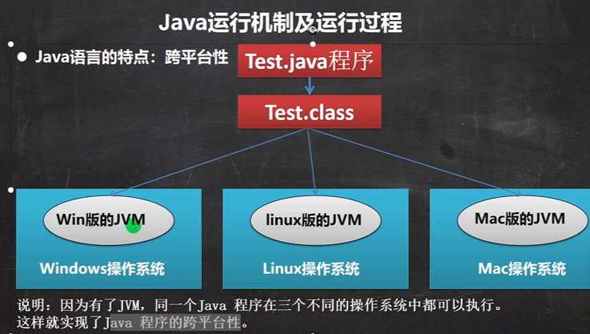

JVM是包含在jdk里面的。

- JDK全称为Java开发工具包，JDK=JRE+java的开发工具（java javac等）
- JRE全称为Java运行时环境，JRE=JVM+核心类库

所以，对于程序员，要JDK；对于使用者，JRE就可以运行.class文件了！

## 1.3、个人相关

官网上下载jdk，可以看到里面有jre包


配置环境变量之后

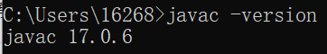

## 1.4、一些注意事项

- 一个源文件最多只能有一个public类（可以没有），可以有多个其他类
- 如果源文件有public类，那么源文件名应该和这个public一致
- 对main方法的位置不做要求，可以在public类下，也可以不在，一个源文件可以有多个main方法


# 2、基础、变量、运算符

## 2.1、转义字符6

```java
System.out.println("你好\t啊");制表位
System.out.println("你好\n啊");换行
System.out.println("你好\\啊");输出\
System.out.println("你好\'啊");输出'
System.out.println("你好\"啊");输出"
System.out.println("你好\r啊");回车，在不同的平台上表现不一样，idea输出“啊”，控制台输出“啊好”
```

## 2.2、注释3

```java
// 单行注释

/* 多行注释

 */

下面是文档注释，@里面的内容叫文档标签（有规范，不是爱咋写咋写的），文档注释可以被jdk提供的javadoc解析为网页形式的说明文档，一般写在类和方法层面。
具体如何生成网页这里不介绍。
对于类和方法的注释最好使用文档注释。
/**
 * @author yzy
 * @version 1.0
 */
class Dog{
    
}
```

## 2.3、DOS命令（略）

控制台指令

## 2.4、数据类型8+3

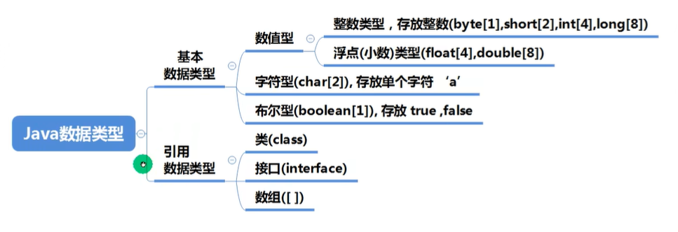

整数类型详解：

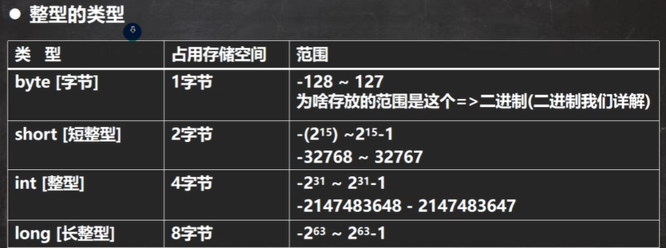

```java
int a = 10;√  直接写一个数的话默认是int
int b = 10l;× 不像c++ 不会自动强制转换 需要手动
long c = 10;√ 自动类型转换
long d = 10l;√
```


浮点数类型详解：

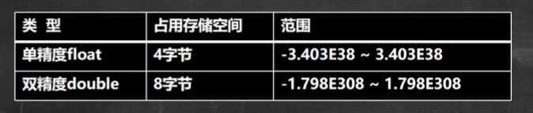

- 浮点数=符号位+指数位+尾数位
- double的范围和精度都 > float
- int和float都是4B，但是范围却大了很多，所以float的精度不如int，本质上是一种取点近似
- 注意“浮点陷阱”，运算后的浮点数不要直接比较

```java
float a = 10.0f;√
float b = 10.0;× 不像c++ 不会自动强制转换 需要手动
double c = 10.0f;√ 自动类型转换
double d = 10.0;√ 直接写一个小数的话默认是double
```

 

字符类型详解：

```java
char a = 971;字符类型在底层存的是数字unicode，所以直接赋给char数字也是可以的，范围0-2^15-1
System.out.println(a);会自动把数字转为字符
    
char a = 'a' + 1;
System.out.println(a);字符本质是数字，所以可以进行加减，这里会输出字符b
```

- ascii
- unicode：字母汉字统一2B，包含世界上所有的符号，但是有点浪费，兼容ascii码
- UTF-8：变长存储，字母1B，汉字3B，是对unicode的改进，目前使用最多


布尔类型详解：

只有两种，true和false，与c不同，不可以使用0或者非0数字表示false或者true


## 2.5、数据类型的转换

**基本数据类型的自动类型转换**：jvm可以将范围小的类型自动转为范围大的类型（没错，float的范围远远大于8B的long）

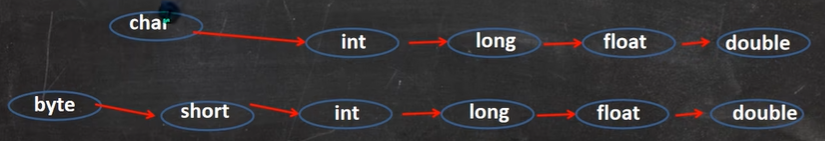

细节：

- 多类型混合计算时，jvm自动将他们转为范围最大的那一个，然后才进行计算，但有例外

- char和（byte，short）之间不发生任何自动类型转换

- 你想把大范围类型转为小范围类型，一定报错，下面的例子除外

- ```java
  byte a = 10;虽然10是int，但是编译器会自动检查他有没有超过127，没有超过就可以
  
  int b = 10;
  byte c = b;这种就会报错，违背链
  ```

- char、byte、short之间可以运算，运算的时候会先转成int类型，看下面

- ```java
  byte a = 10;
  byte b = 10;
  short c = 10;
  short d = a + b;错误 已经转成int了
  int e = a + c;正确
  ```

- 注：double转int会擦去小数点


**基本数据类型的强制类型转换**：人工将范围大的类型转为范围小的类型

细节：

- 强转符号()只对最近的数有效，所以有的时候需要加括号改变优先级

- 对于char来说

- ```java
  int a = 100;
  char b = 100;虽然100是int，但是编译器会自动检查他有没有超限，没有超过就可以
  char c = a;错误 违背链
  char d = (char)a;正确
  ```


**8大基本数据类型转为String**

```java
int a = 10;
String s = a + "";加上""即可
```


**String转8大基本数据类型（8大基本数据类型 每个都有自己的包装类）**

```java
String s = "110";

byte n1 = Byte.parseByte(s);
short n2 = Short.parseShort(s);
int n3 = Integer.parseInt(s);
long n4 = Long.parseLong(s);

float n5 = Float.parseFloat(s);
double n6 = Double.parseDouble(s);

char ch1 = s.charAt(0);

boolean boo1 = Boolean.parseBoolean("true");
```

## 2.6、运算符4

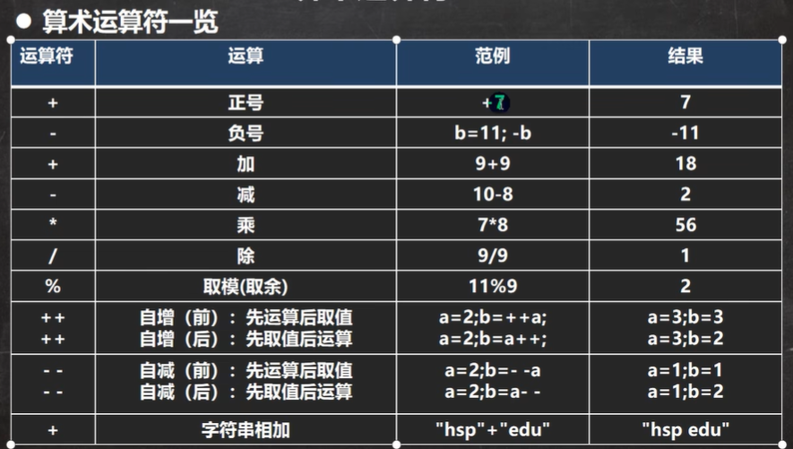

几道例题：

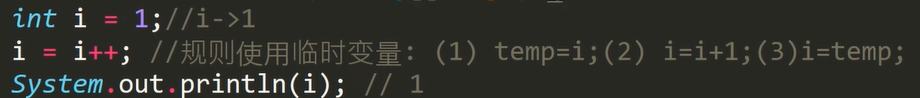

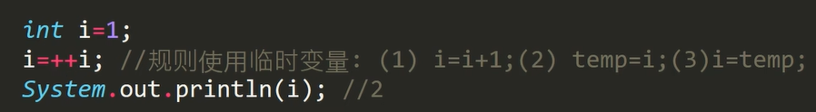

```java
int a = 3/5;最后a=0 整数除法是整除
```

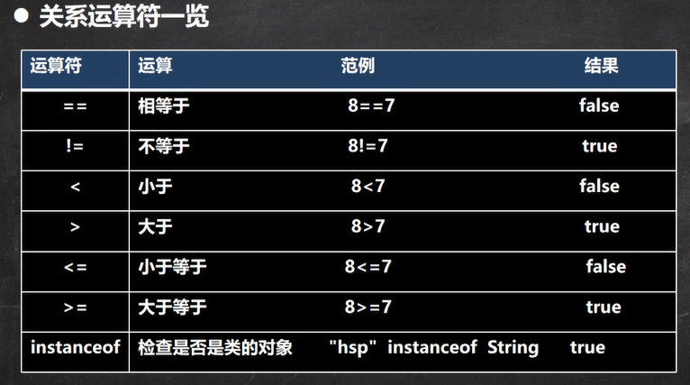

关系运算符的结果是true或者false

```
++a > 1先自增 再赋值比较
a++ > 1先比较 再自增
！！！这个和优先级不冲突
```

逻辑运算符如下：
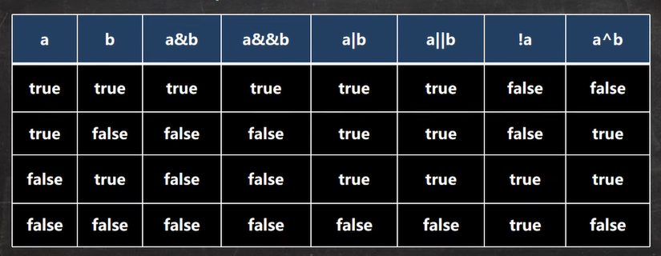

&和&&的区别：&&更高效 ，用得多。  |和||也是同理。

赋值运算符的细节：

```java
byte a = 1;
a = a + 1;错误 int不能自动转byte
a += 1; 正确 +=操作会自动进行类型转换 因此 虽然二者等效 但是用下面的更好
```

**特别注意：赋值操作的返回值是赋值结束之后的值**

唯一三元运算符：


运算符的**大致优先级顺序**：括号 单目的加加减减 算术 移位 比较 逻辑 三元 赋值

## 2.7、命名规范

- 变量名可以使用26个字母的大小写，数字0-9，_和$
- 变量名数字不能打头
- 包名：全小写
- 类名和接口名：大驼峰
- 成员变量和成员方法：小驼峰
- 常量名：全大写，单词之间下划线  eg：TAX_RATE

## 2.8、输入

```java
import java.util.Scanner;

Scanner sc = new Scanner(System.in);
String s1 = sc.next();返回字符串 遇到空格或者换行停止
String s2 = sc.nextLine();如果需要输入有空格的字符串 用这个
int n1 = sc.nextInt();返回int类型的
double d1 = sc.nextDouble();
sc.close();关闭输入流
```


## 2.9、位运算

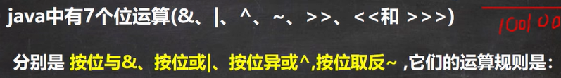

前四种运算的原则：

- 正数的原码=反码=补码
- 负数的反码=原码除了符号位外按位取反，负数的补码=负数的反码+1
- 前四个运算基于补码进行
- 但是最后结果呈现原码

eg1：

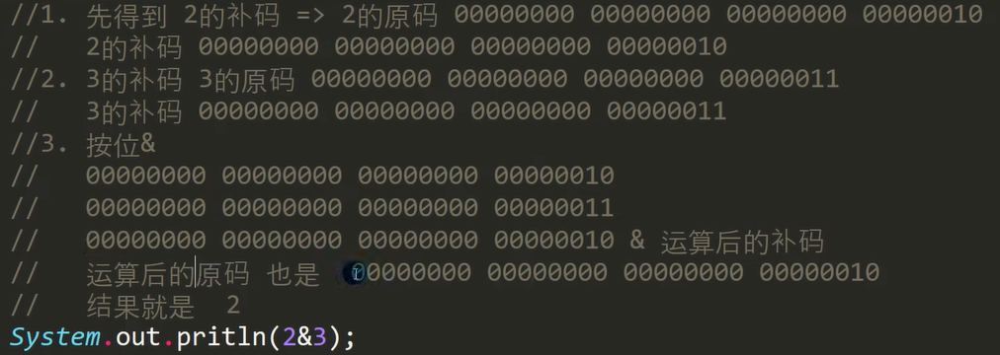

eg2：
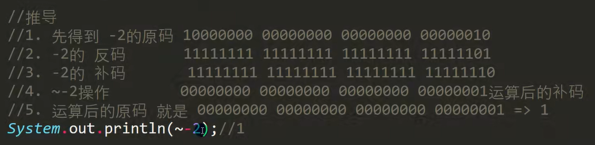

eg3：
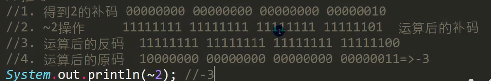


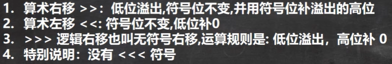

或者可以这么理解（对于整数）：>>相当于每次除2；<<相当于每次乘2


# 3、三大控制结构

## 3.1顺序

 略

## 3.2分支

```java
单
if(a > 1) {
    System.out.println();
}
双
if(a > 1) {
    
}else {
    
}
多
if(a > 1) {
    
} else if (a < 1) {
    
}else {
    
}
```

```java
int a = 1;
switch(a) {表达式，这里表达式的值应该和常量的类型一致或者能进行自动转换
    表达式的返回值只能是byte short int char String enum（浮点肯定不能拿来比较）
    
    case 1:这里应该是常量
        System.out.println(1);
        break;一般要有 没有会穿透
    case 2:
        System.out.println(2);
        break;
    case 3:
        System.out.println(3);
        break;
    default:
        System.out.println(4);
        break;
}
```

## 3.3循环

```java
for (int i = 0; i < 10; i++) {
    System.out.println(i);
}初始化之后也是先判断 true才执行

int i = 0;
while (i < 10) {
    System.out.println(i);
    i++;
}


do {
    System.out.println(i);    
}while (i < 10);最少都会执行一次
```

- break：跳出循环。可以使用标签指定跳出的循环，不指定则跳出最近的循环，一般不指定。
- continue：跳出本次循环（即到达}处），进入下一次循环。可以使用标签指定跳出的循环，不指定则跳出最近的循环，一般不指定。
- return：跳出方法。

# 4、引用数据类型——数组

## 4.1、初始化3

```java
动态1：
int[] arr1 = new int[5];
动态2：
int[] arr2;
arr2 = new int[5];new的时候才分配空间
静态1：
int[] arr3 = {1,2,3,4,5};
```

- 数组分配空间后，如果没赋值，jvm会默认赋值，整数0，浮点0.0，char0，boolean为false，String为null。这里的默认赋值方法是通用的。
- 数组可以存放基本数据类型或者引用数据类型class等，但是不可以混用
- 当数组存放引用数据类型的时候，一般需要new2次，第一次开辟空间，第二次给里面初始化对象，如下：

```JAVA
Dog[] dogs = new Dog[3];
dogs[0] = new Dog();
dogs[1] = new Dog();
dogs[2] = new Dog();
```

## 4.2、值copy和址copy

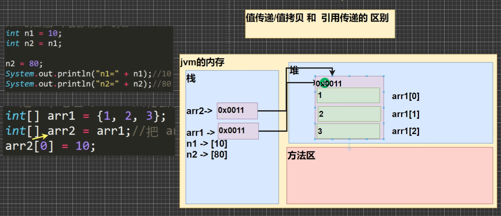

- 值copy：**基本数据类型**为值传递
- 址copy：**引用类型**为址传递，其实本质上还是值传递，只不过这个值是地址罢了。所以如果你想copy一个引用类型对象，你应该新建一个，然后复制每个属性。

## 4.3、二维数组

```java
动态初始化1
int[][] arr1 = new int[2][3];
动态初始化2
int[][] arr2;
arr2 = new int[2][3];
静态初始化1
int[][] arr3 = {{1,2,3},{1,2,3},{1,2,3}};

注意：如果列数不固定 可以使用下面的方法（2次new）
int[][] arr1 = new int[2][];这个时候每个一维数组还没有呢
arr1[0] = new int[2];
arr1[1] = new int[4];
```

内存排布：

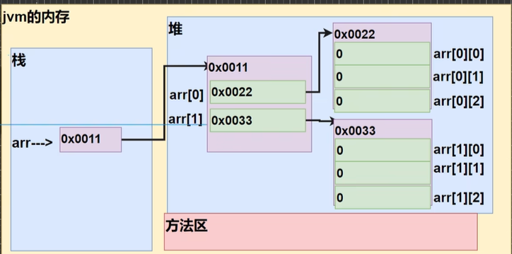

# 5、类与对象

## 5.1、内存形式

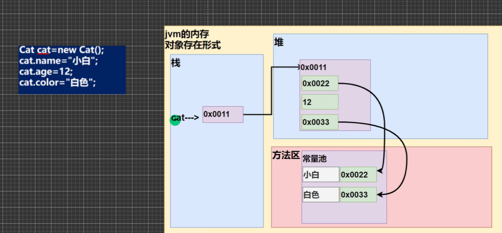

- 基本数据类型一般在栈。而且只有init的时候才会分内存。
- 引用数据类型一般在堆。只有new的时候才会分内存。

## 5.2、成员方法的内存形式

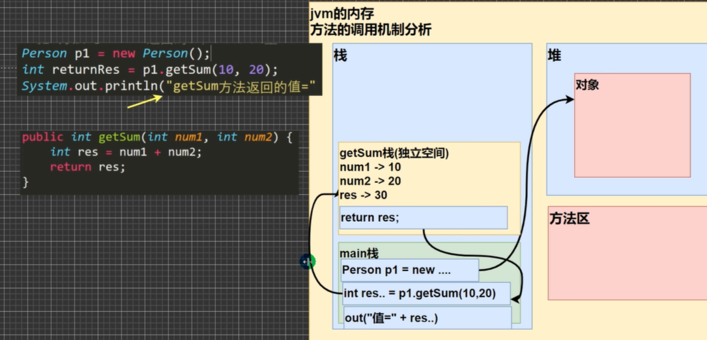

总之：遇到成员方法就会开辟新空间压栈，方法结束之后出栈。

## 5.3、成员方法的使用细节

- 如果返回为void，可以不写return，或者直接ruturn；

- 成员方法的返回值可以是任意类型，包括基本和引用
- 基本数据类型的传参机制：传入的值会被copy，所以在成员方法内修改基本数据类型，成员方法外不会改变。这里与4.2类似。
- 引用数据类型的传参机制：传入的是**地址**，相当于地址被copy了一份，所以在成员方法内部修改，成员方法外是会改变的。这里与4.2类似。可以看下下面的2个测试题：

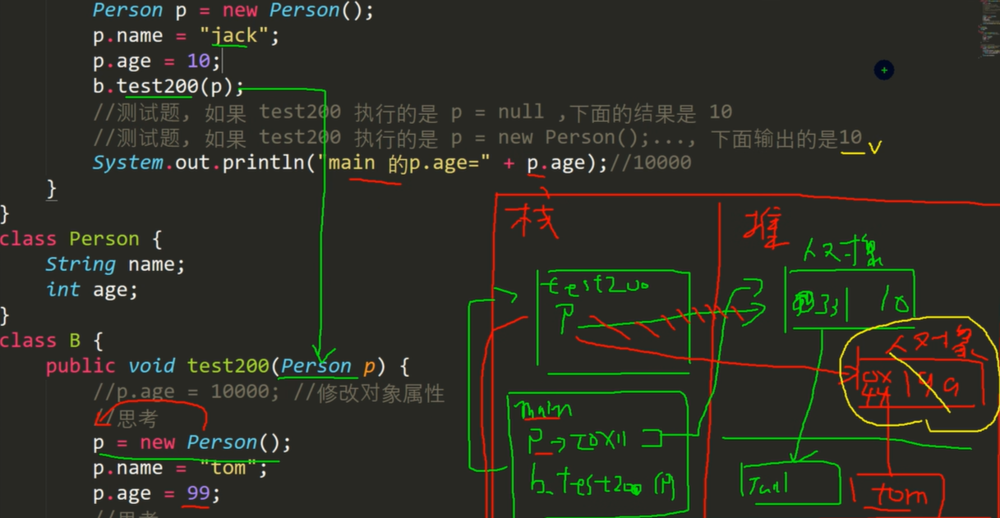

## 5.4、overload重载与可变参数

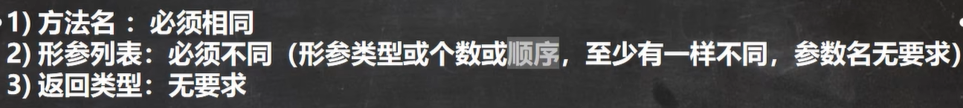

这意味着：成员方法的身份id：方法名，形参的类型和个数和顺序。参数名不是id。即：overload涉及到的其实是不同的成员变量。

但是overload有时候很麻烦，比如下面一堆函数，所以我们可以把这三个函数优化一下，使用“可变参数”。

```java
class Calculator{
    public int add(int x, int y){
        return x+y;
    }
    public int add(int x, int y, int z){
        return x+y+z;
    }
    public int add(int x, int y, int z, int k){
        return x+y+z+k;
    }
}
```

优化：

```java
class Calculator{  int表示要传入的一堆参数是int类型的 nums可以理解为数组
    public int add(int...nums){
        int result = 0;
        for (int i = 0; i < nums.length; i++) {
            result += nums[i];
        }
        return result;
    }
}
```

- 调用的时候直接调add(1,2,3,4,5)或者也可以传入数组add(nums)，因为可变参数的本质就是数组。
- 一个形参列表最多只能有一个可变参数
- 如果有可变参数和正常参数，可变参数必须放在最后面

## 5.5、成员变量和局部变量

- 成员变量：可以不初始化直接使用，默认值是jvm给予的 因为在new对象的时候会自动分空间
- 局部变量：（成员方法里面的变量 作用域只有那个代码块）不初始化不可使用

```java
class Calculator{
    public int x;
    
    public void add(){
        int y;
        x += 1;成员变量可以直接使用 因为在new对象的时候会自动分空间
        y += 1;报错
        return;
    }

}
```

注：局部变量可以和成员变量重名，调用时遵循”就近原则“

成员变量可以有4类访问修饰符；局部变量没有。

## 5.6、constructor构造器

constructor的目的是对对象**进行init，而不是创建对象**，换言之对象已经存在了。

特点：

- 名称和类名一致
- 没有返回值
- jvm自动调用，即不可以通过手动调用
- 如果程序员没有定义构造器，系统其实会有一个默认的无参构造器    Dog(){}
- 一旦自己定义了构造器，默认的无参构造器就会失效，所以一般建议自己再显示定义一个无参构造器
- constructor的修饰符可以是那四个 **建议使用public** 

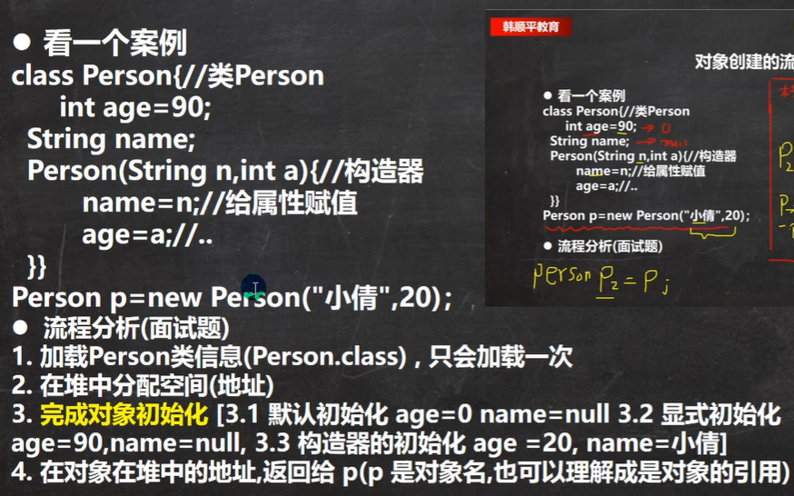

## 5.7、this

this：表示当前对象。（即哪个对象正在调用，那么this就是哪个对象）

```java
class Dog{
    private String name;
    private int age;

    public Dog(String name, int age) {
        this.name = name;
        左边的name有this修饰表示的是成员变量 右边的name根据“就近原则”是传入的局部变量
        this.age = age;
    }

    public void test() {
        在main中调用这个方法时 this指代的是调用这个方法的对象 所以打印的hash和main中对象自己hash一致
        System.out.println("this的hash"+this.hashCode());
    }
}
```

使用细节：

- 在成员方法f2中想要调用成员方法f1，第一种方法直接写f1(); 第二种方法是写this.f1()
- 在构造器1中想运行构造器2，可以使用如下的语法格式，**而且这句话必须放在第一行**，这种方法只能在构造器之间互相使用，不可以和普通成员方法混用

```java
public Dog() {
    this("ss",10);在这里会调用构造器2 中间没有. 原因很简单 构造器是不能够人为调用的 所以不能用.
    System.out.println("构造器1被调用");
}

public Dog(String name, int age) {
    this.name = name;
    this.age = age;
    System.out.println("构造器2被调用");
}
```


# 6、OOP三大特点

## 6.1、IDEA快捷键

```
ctrl+/：注释
ctrl+d：删除当前行
ctrl+alt+下箭头：向下复制改行
alt+enter：自动导包
ctrl+alt+F：格式化代码
ctrl+H：查看继承关系
ctrl+B：查看源代码
new对象.var：自动添加对象名称
```

## 6.2、包

包：可以理解为存放java文件的文件夹

命名规范：com.公司名.项目名.业务名   一般小写

- lang包一般是自动引入的，里面包含基本数据类型
- Scanner类来自于util包

## 6.3、访问修饰符

可以修饰**成员变量**（4）和**成员方法**（4）和**类**（只有public和默认）

- public：对外公开
- protected：对同一个包公开，对自己的子类公开
- 默认：对同一个包公开
- private：只对本类公开


## 6.4、封装

- 成员变量加private
- 成员变量有对应的set和get方法
- constructor
- 如果set和get方法有校验数据的逻辑，constructor可能会成为一个漏洞，所以这个时候建议将constructor和set、get结合起来


## 6.5、继承

```java
class Student{
    
}
class Graduate extends Student{
    
}
```

细节：

- 子类继承父类所有的成员变量和成员方法（可以理解为**代码copy**）。但是私有成员变量和方法子类不可以直接访问，只能通过父类提供的公共的方法进行访问；非私有的成员变量和方法子类才可以直接访问
- 创建子类对象的时候，调用子类的构造器，但是子类的构造器一定会首先调用父类的构造器。即子类构造器**第一行**默认有个super()，表示默认调用父类的无参构造器。如果父类没有无参构造器，那么要么人为指定一个父类构造器super(参数列表)，要么报错。
- super()和this()都要放在构造器第一行，所以这两个不能同时出现在一个构造器里面，如果你写了this()，那么默认的super()会被顶掉
- Object是所有类的父类
- 子类构造器的调用不限于直接父类，而是会回到顶级父类Object，可以这么理解：父类的构造器其实里面也有super（）
- 一个子类只能继承于一个父类


crucial：说一下对第一点中代码copy的理解：比如对于下面的代码，在main中new一个s对象，那么我们可以访问得到这个s的name是3，age是10，score是20.12，即父类的代码会copy到子类里面。至于name为啥是3也很好理解，前面的name被**覆盖**掉了（这种覆盖按照名字来区分，比如父类的name是int类型，子类是String类型，也会覆盖）。如果s类里面的name被private修饰了，还可以访问到s.name吗？答案是不可以访问的，不会返回2，完全不可以访问。

上面说的copy理论不仅对于成员变量有用，对于成员方法同样有效，这个和下面的override有关联。

```java
class Gf{
    String name = "1";
    double score = 20.12;
}
class f extends Gf{
    String name = "2";
    int age = 10;
}
class s extends f{
    String name = "3";
}
```


super的更多用法：比如说子类和父类中都有name成员变量，在子类中我突然想使用父类的name（被覆盖掉了），这个时候我们可以使用supre关键字。因为super关键字代表本对象的父对象。当然注意，super不可以访问父类的私有变量，不可以和前面的规定相冲突。

```java
class f{
    String name = "1";
}

class s extends f{
    String name = "2";
    
    public void test() {
        System.out.println(this.name);这里一定输出2 因为name早就被s覆盖掉了
        System.out.println(super.name);这里输出1 指定要父类的name。如果f里面没有name，那么会找f的													父类的name，其实这个时候也就是f的name了
    }
}
```

## 6.6、override重写

在6.5的代码copy处已经说过了。子类的成员方法和父类的成员方法理论上只有2种关系：

- 身份id一样：子类将会覆盖（重写override）父类的成员方法。**但是注意，对这两个方法的返回类型提出了要求：要么一致，要么父类方法的返回类型是子类方法的返回类型的父类，否则将会报错。而且子类的方法不可以缩小父类方法的访问控制符范围，否则将会报错。**
- 身份id不一样：那这没有什么好说的，代码叠在一起就可以了


## 6.7、多态

等号左边的是“编译类型”，右边的是“运行类型”。编译类型不可以改变，运行类型可以改变。注意二者需要存在继承关系。

```java
Animal a1 = new Dog();
a1 = new Cat();
```

多态的前提：2个类之间存在继承关系。多态是建立在封装和继承之上的。在我眼里，多态其实就两个：向上转型与向下转型，当然，重载和重写也算是多态的表现。

### 6.7.1、向上转型

即父类引用指向子类对象

```java
Animal a1 = new Dog();
```

细节：a1**只**可以调用父类中声明过的所有成员变量/成员方法，如果一个成员变量/成员方法是子类特有的，那么不可访问。访问的时候也会遵循访问修饰符。

**！！！注意**：如果一个成员变量/成员方法子类和父类都有，那么具体调的谁呢？如果是成员变量，那么调的一定是父类的（唯一不符合copy原理）；如果是成员方法，那么取决于copy原理。


### 6.7.2、向下转型

其实是向上转型的恢复过程。所以先向上转型，然后对应的向下转型。

```java
Dog a2 = (Dog)a1;
```

这个时候相当于是

```java
Dog a2 = new Dog();
```

那a2自然而然可以使用子类的所有成员变量/成员方法，跟基础部分一致。

在这里提一嘴一个特殊的运算符：instanceof，用于判断一个对象的运行类型是不是一个某个类或者某个类的子类。

```java
Animal animal = new Dog();
System.out.println(animal instanceof Animal);true
System.out.println(animal instanceof Dog);true
System.out.println(animal instanceof Cat);false
```

### 6.7.3、动态绑定机制（重要）

- 成员方法有动态绑定机制：与运行类型相互绑定
- 成员变量没有动态绑定机制：哪个近用哪个

demo01：Animal a = new Dog();调用a.test()，运行的子类的test方法，a是20

```java
class Animal{
    int a = 10;
    public void test() {
        System.out.println(a);
    }
}
class Dog extends Animal{
    int a = 20;
    public void test() {
        System.out.println(a);
    }
}
```

demo02：Animal a = new Dog()，调用a.test()，运行的父类的test方法，a是10

```java
class Animal{
    int a = 10;
    public void test() {
        System.out.println(a);
    }
}
class Dog extends Animal{
    int a = 20;
}
```

demo03：Animal a = new Dog()，调用a.test()，运行的子类的test方法，a是10

```java
class Animal{
    int a = 10;
    public void test() {
        System.out.println(a);
    }
}
class Dog extends Animal{
    public void test() {
        System.out.println(a);
    }
}
```

demo04（典型）：Animal a = new Cat()，调用a.test()，运行父类的test方法，然后运行子类的test02方法，输出2

```java
class Animal {
    public void test() {
        test02();
    }
    public void test02() {
        System.out.println(1);
    }
}
class Cat extends Animal {
    public void test02() {
        System.out.println(2);
    }
}
```

### 6.7.4、多态应用——多态数组

每个都相当于是向上转型。下面的形式也是一般情况下类数组的表现形式，即两次new。

```java
Animal[] animals = new Animal[5];
animals[0] = new Dog();
animals[1] = new Cat();
animals[2] = new Dog();
animals[3] = new Cat();
animals[4] = new Dog();
```

### 6.7.5、多态应用——多态参数

成员方法的形参为父类，实参可以传入子类。实际上是向上转型。


## 6.8、Object

Object中有很多方法，因为是所有类的父类，所以所有的类都可以使用这些方法。下面我们挑4个讲解一下：equals、hashCode、toString、finalize

讲equals前先介绍一下==比较符：

- 既可以比较基本数据类型， 也可以比较引用类型
- 如果是基本数据类型，那么就比较值是否相等
- 如何是引用类型，那么就比较地址是否相等（即是否指向的是同一个对象）


下面介绍一下Object里面的equals方法：

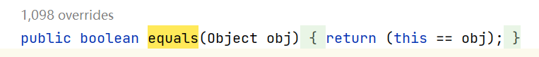

其只可以用于引用数据类型，可以看到他默认是使用了==符，默认判断两个对象的地址是不是一样。

但是他的子类一般都override这个方法，用来比较两个类的值是否相等，比如String、Integer就override了。


hashCode：将对象的地址hash一下后返回，返回为int类型。使用方法：对象.hashCode()


toString()：默认返回对象的全类名（包名+类名） + @ + hash码的16进制，返回字符串类型

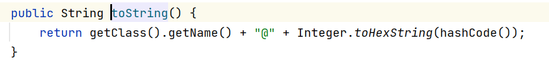

子类一般会override这个方法。一般，print对象的时候，本质上就是调用了toString方法，即下面2个结果一样

```java
System.out.println(cat);
System.out.println(cat.toString());
```


finalize()：当一个对象的引用数目=0的时候，说明其变成了一个垃圾，这个时候jvm会调用对象的finalize，进行垃圾回收。所以可以在子类override该方法时，写入一些回收资源的操作。


# 7、面向对象高级

## 7.1、类变量与类方法static

类变量（静态变量）：该类的所有实例共享。这个类变量在**类加载**的时候会被放在堆中，所有的实例化对象都会指向这个类变量。

```java
class Dog {
    public static String name = "yzy";定义
}
```

```java
使用2
推荐使用下面这种方式 直接通过类名访问 注意访问的时候遵守访问修饰符权限 因为类变量在类加载的时候就在了 所以可以不实例化而直接使用
System.out.println(Dog.name);
System.out.println(new Dog().name);
```


类方法（静态方法）：该类的所有实例共享。

```java
class Dog {
    public static void func1() { 定义
        System.out.println(1);
    }
}
```

```java
使用2
推荐使用下面这种方式 直接通过类名调用 注意调用的时候遵守访问修饰符权限 因为类方法在类加载的时候就在了 所以可以不实例化而直接调用
Dog.func1();
new Dog().func1();
```

注意事项：

- 类方法常常用于工具类，比Math等类
- 普通方法和类方法都是随着**类的加载**而创建，存在方法区中
- 类方法在没有实例化对象的时候要求可以使用，所以类方法中严禁使用和对象有关的关键字：super和this
- 类方法中只能使用类变量和类方法，原因很简单，类方法在没有实例化对象的时候要求可以使用，都没有实例化就没有成员变量和成员方法，所以类方法中只能使用类变量和类方法
- 简而言之：类方法只能使用类变量和类方法，还有临时变量；成员方法可以任意使用
- 类方法不可以被override

## 7.2、main

- jvm（位于不同的类中）调用main方法，所以肯定是public
- jvm不想创建对象，所有需要static
- main方法的参数args也可以使用：编译结束之后运行的时候，dos输入“java 程序名 参数1 参数2 参数3”；IDEA中也可以传
- main方法中可以直接使用该类的类变量或者类方法；不能直接使用该类的成员变量和成员方法，必须new一个本对象才可以使用

## 7.3、代码块

语法2：静态代码块和普通代码块

```java
static{

}
```

```java
{

}
```

细节：

- 静态代码块随着**类加载**而执行，并且只执行一次；普通代码块，每创建一个对象就执行一次

- **类啥时候加载呢？**new对象时，该类会被加载；创建子类对象的时候，父类也会被加载，而且是父类先加载；使用类的类变量或者类方法的时候，类会被加载，静态代码块先执行，如果这个类有父类，那么父类先被加载。但是不管是因为啥原因导致静态代码块被执行的，他只会执行一次

- 普通代码块，每创建一个对象就**执行一次**，可以把它理解为**拼接在构造器前部**，注意他一次对象创建过程只会执行一次，如果只是使用类的类变量或者类方法，普通代码块是不会执行的

- 可以把普通代码块看为构造器的补充，即可以把构造器中的公共部分提取出来放进普通代码块，提高代码复用

- new对象的时候的顺序（3）：调用**静态代码块**和**类变量行代码**（二者优先级相同，依次运行）（**这个其实就是类加载阶段**）——>调用**普通代码块**和**成员变量行代码**（二者优先级相同，依次运行）——>构造器

- ```java
  class Dog {
      static {
          System.out.println("静态代码块执行");1执行 只执行一次
      }
  
      private static int a = getA();2执行 只执行一次
  
      public static int getA() {
          System.out.println("类变量初始化");2执行
          return 0;
      }
  
      {
          System.out.println("普通代码块执行");3执行 执行多次
      }
  
      private int b = getB();4执行 执行多次
  
      public int getB() {
          System.out.println("成员变量初始化");4执行
          return 0;
      }
  
      public Dog() {
          System.out.println("构造器");5执行 执行多次
      }
  }
  ```

- 每个构造器的前面其实隐藏了（1）super（2）普通代码块。执行super跳到父类构造器的时候也会遇到这两个，super和普通代码块
- 继承关系下，new对象的时候的顺序（6）：父类**静态代码块**和**类变量行代码**（二者优先级相同，依次运行）（**父类加载阶段**）——>子类**静态代码块**和**类变量行代码**（二者优先级相同，依次运行）（**子类加载阶段**）——>父类**普通代码块**和**成员变量行代码**（二者优先级相同，依次运行）——>父类构造器——>子类**普通代码块**和**成员变量行代码**（二者优先级相同，依次运行）——>子类构造器
- 静态代码块只能使用类变量和类方法，还有临时变量；普通代码块可以随意使用（这里的特点与类方法的特点相似）


## 7.4、final

- final修饰类：该类不可以被继承
- final修饰成员变量：该变量不可以被修改
- final修饰成员方法：该方法不可以被override
- final修饰局部变量：该变量不可以被修改

下面可以看到：final的放置位置和static差不多，在public这些后面

```java
final class Dog{
    private final double TAX_RATE = 1.0;
    public final void test() {
        final int date = 12;
    }
}
```

细节：

- final修饰的成员变量因为不可以被修改，所以又称为**常量**，常常使用xxxx_xxxx命名
- final修饰的成员变量必须赋值（常量肯定要赋值才行），赋值位置有三种：定义时、构造器里面、代码块里面
- final和static可以结合在一起修饰成员变量，这个时候，赋值位置只有2种：定义时、静态代码块里面
- final类不可以继承，但是可以实例化对象
- final修饰类了之后，该类已经不能被继承了，再给成员方法加上final修饰，语法没问题，但是画蛇添足
- final不可以修饰构造器
- final和static搭配在一起效率高，可以在不加载类的情况下使用类变量

```java
class Dog{
    如果这里不写final，当在main中调用Dog.age的时候，下面的静态代码块也会执行，如果加了final，调用		Dog.age的时候，类不会加载，就不会执行下面的静态代码块了，底层做了优化
    public static final int age = 11;
    static {
        System.out.println("静态代码块被调用了");
    }
}
```

- 八大包装类都是final的


## 7.5、抽象类abstract

概论：abstract是**对继承机制的进一步抽象**，比如现在有个父类，里面有个方法，但是我也不知道这个方法里面应该写啥，这个时候就可以把这个方法使用abstract修饰，然后这个方法就可以不写方法体了

下面可以看到：abstract的放置位置和final差不多，在public这些后面

```java
abstract class Animal{
    
    public abstract void eat();
    
}
```

- 一个成员方法被abstract修饰，那么这个方法又称为**抽象方法**；那么这个类**必须**被abstract修饰，称为**抽象类**
- 抽象类不可以被实例化
- 抽象类可以没有抽象方法
- abstract只可以修饰类和方法
- 抽象类本质上还是类，所以正常类可以有的他也可以有
- 抽象方法不可以实现，不能写{}
- 如果一个类**继承**了抽象类，那么他必须**实现（override）**这个抽象类的**所有**抽象方法，除非他自己也声明自己是一个抽象类
- 抽象方法不可以使用private、static、final修饰，这和override违背，建议使用public
- 抽象类是对继承的进一步抽象，所以也是有向上转型、向下转型的


## 7.6、接口

**接口=规范，规范就是抽象。**接口是对abstract类的进一步抽象。

或者可以理解：子类继承了父类，自动拥有父类的方法；如果实现了接口，那么相当于拓展功能；即接口是对java单继承机制的一种补充。

```java
interface H{
    public void fun1();//这些其实是抽象方法abstract 但是在interface中可以省略abstract 默认有
    public void fun2();
}
```

```java
public interface H{//如果有public 那么文件名应该和接口名一致
    public void fun1();
    public void fun2();
}
```

```java
class A implements H{
    @Override
    public void fun1() {
        
    }

    @Override
    public void fun2() {

    }
}
```

- 类A实现implements了接口H，那么A需要override H中的**所有**的抽象方法

- jdk7之前，接口中不可以写方法的具体实现，全部默认abstract；jdk8之后，可以写入方法的默认实现和类方法（即此时接口中的方法有三种类型）

- ```java
  interface H{
      public void fun1();abstract方法
      public void fun2();abstract方法
      
      默认方法，需要在最前面加上default进行修饰，用的不多
      default public void fun3() {
          
      }
      也可以有静态方法，用的不多
      public static void fun4() {
          
      }
  }
  ```

- 接口不可以被实例化，跟抽象类是一样的
- 接口中的所有方法必须是public的，不写也默认是public的，建议写上
- 如果是抽象类implements接口，可以不override所有的抽象方法
- java是单继承，多实现机制
- 接口是可以写**成员变量**的，而且必须使用public static final修饰，int a = 1其实默认就是public static final int a = 1，因为是常量，所以必须给初始值。访问：接口名.常量名
- 一个类implements了一个接口，那么接口中的成员变量其实相当于**copy**到了这个类里面，所以也可以通过 类名.常量名 来访问
- 类和类之间有extends；类和接口之间是implements；接口和接口之间也是extends，而且一个接口可以extends多个接口


都说了接口是对抽象类的进一步抽象，而抽象类是对继承的抽象，所以接口也是有多态的。也有向上转型和向下转型，应用也有数组和参数两种形式。

app1：其中USB是接口，Phone和Camera两个类实现了这个接口

```java
USB[] usb1 = new USB[2];
usb1[0] = new Phone();这里其实暗含了向上转型
usb1[1] = new Camera();
```

app2：其中USB是接口，Phone和Camera两个类实现了这个接口

```java
public class test {
    public static void main(String[] args) {
        test c = new test();
        c.use(new Phone());这里其实是向上转型 USB usb = new Phone()
    }
    public void use(USB usb) {
        usb.fun1();
        usb.fun2(); usb接口有2个抽象方法 Phone里面一定实现了 直接调用
            
        if (usb instanceof Phone) {想要使用Phone的专有方法 只能向下转型
            Phone phone = (Phone) usb;
            phone.phoneFun();
        }
        if (usb instanceof Camera) {想要使用Camera的专有方法 只能向下转型
            Camera camera = (Camera) usb;
            camera.cameraFun();
        }
    }
}
```


下面说一下接口的传递：USB2继承了USB1，Phone实现了USB2，其实也算实现了USB1，因为USB2继承于USB1可以理解为copy了一下，所以可以USB1 phone = new Phone()

```java
interface USB1{
    public void fun1();
}
interface USB2 extends USB1{
}
class Phone implements USB2 {
    @Override
    public void fun1() {
        
    }
}
```


# 8、内部类、枚举、注解、异常

## 8.1、四大内部类

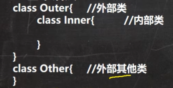

类有5大成员：成员变量、成员方法、构造器、代码块、内部类

分类如下：


### 局部内部类

```java
class Outer {//这是外部类
    //私有成员变量
    private int age = 10;
    //私有成员方法
    private void fun1() {
        System.out.println("这是外部类的私有方法");
    }
	//成员方法
    public void fun2() {
        //下面是局部内部类 定义在外部类的局部位置(方法内或者代码块之内)
        //局部内部类地位相当于一个局部变量 所以跟局部变量一样不可以使用访问修饰符
        //局部内部类可以使用final修饰 即本身可被继承 加了之后不可继承
        //作用域：定义他的方法之中
        //本质还是一个类 所以类有的他一般也有
        
        class Inner {
            public void fun3() {
                System.out.println("这是内部类的方法");
                //局部内部类最大的特点在于可访问外部类的私有成员
                System.out.println(age);
                //如果局部内部类也有一个变量叫age，那么这里在调用的时候遵循就近原则，如果就是想要使用外					部类的age，可以使用fun2.this.age来调用，其中fun2.this表示创造这个内部类的外部类对				   象
                //方法同理，如果局部内部类里面有个方法和外部类一个方法重名，在这里调用的时候遵循就近原				  则，如果就是想要使用外部类的方法，可以使用fun2.this.方法 来调用
                fun1();
            }
        }
        
        //局部内部类的用法：在作用域内新建即可
        Inner inner = new Inner();
        inner.fun3();
    }
}
```

### 匿名内部类（最vital）

```java
class Outer {
	//外部类的成员方法
    public void fun1() {
        //下面就是一个（基于接口）的匿名内部类，定义在外部类的局部位置(方法内或者代码块之内)
        //tiger的编译类型：Animal;运行类型：底层会自动创建一个类，实现Animal接口，然后new这个类，把对			  象返回，这个新类里面的内容就是下面的{}中的
        Animal tiger = new Animal() {
            @Override
            public void cry() {
                System.out.println("老虎叫");
            }
        };    //;别忘掉
        
        //使用：然后可以正常调用这个匿名内部类的方法
        tiger.cry();
        
        //下面是另一个（基于类）的匿名内部类
        //parrot的编译类型：Bird；运行类型：底层会自动创建一个类，继承Bird，然后new这个类，把对			  象返回，这个新类里面的内容就是下面的{}中的
        //这里传入参数会自动调用父类的构造器
        Bird parrot = new Bird("mzz"){
            @Override
            public void eat() {
                System.out.println();
            }
        };
        
    }
}
//这是一个接口
interface Animal {
    public void cry();
}
//这是一个类
class Bird {
    private String name;
    public Bird(String name){
        this.name = name;
    }
    public void eat() {
        System.out.println(1);
    }
}
```

- 匿名内部类可以访问外部类的私有成员
- 同局部内部类一样，匿名内部类的地位就是一个局部变量，所以不可以加访问修饰符
- 如果匿名内部类有一个成员变量和外部类的成员变量重名，那么这里在调用的时候遵循就近原则，如果就是想要使用外部类的成员变量，可以使用 外部类名.this.变量名 来调用，其中外部类名.this表示创造这个内部类的外部类对象
- 方法同理，如果匿名内部类里面有个方法和外部类一个方法重名，在这里调用的时候遵循就近原则，如果就是想要使用外部类的方法，可以使用 外部类名.this.变量名 来调用
- 使用匿名内部类的最佳实践：将匿名内部类对象当成一个实参传递     
- **匿名内部类既定义了类的结构，同时他本身也是一个对象**


### 成员内部类

```java
class Outer {
    private int age = 10;
    //下面就是一个成员内部类的例子
    class Inner {
        public void fun2() {       
        } 
    }
    
    public void fun1() {
        Inner inner = new Inner();
        inner.fun2();
    }

}
```

- 成员内部类的位置：和外部类的成员变量/方法持平

- 可以使用四种修饰符

- 一般使用：在外部类的另一个方法中新建内部类对象，然后调用内部类的方法

- 在外部其他类也可以使用内部类，有2种方法

  ```java
  //方式1：
  Outer outer = new Outer();
  Outer.Inner inner = outer.new Inner();
  //方式2：
  在外部类中建立一个返回内部类实例的方法，直接返回
  ```

- 如果内部类有一个成员变量和外部类的成员变量重名，那么这里在调用的时候遵循就近原则，如果就是想要使用外部类的成员变量，可以使用 外部类名.this.变量名 来调用，其中外部类名.this表示创造这个内部类的外部类对象

- 方法同理，如果内部类里面有个方法和外部类一个方法重名，在这里调用的时候遵循就近原则，如果就是想要使用外部类的方法，可以使用 外部类名.this.变量名 来调用


### 静态内部类

```java
class Outer {
    private static int age = 10;

    static class Inner {
        public void fun2() {
            System.out.println(age);
        }

    }
    
    public void fun1() {
        Inner inner = new Inner();
        inner.fun2();
    }

}
```

- 静态内部类的位置：和外部类的成员变量/方法持平

- 可以使用四种修饰符

- 可以直接访问外部类的静态成员，不能访问非静态成员

- 使用static修饰：这是static第一次修饰class

- 一般使用：在外部类的另一个方法中新建内部类对象，然后调用内部类的方法

- 在外部其他类也可以使用内部类，有2种方法

  ```java
  //方式1：
  Outer.Inner inner = new Outer.Inner();
  //方式2：
  在外部类中建立一个返回内部类实例的方法，直接返回
  ```

- 如果内部类有一个成员变量和外部类的成员变量重名，那么这里在调用的时候遵循就近原则，如果就是想要使用外部类的成员变量，可以使用 外部类名.变量名 来调用，这里和前面三个不一样，因为能在内部类使用的一定是静态的
- 成员方法同理


## 8.2、枚举类enum

需求：比如我定义了一个季节类，那这个类的对象其实应该只有四种：春夏秋冬。但是如果按照之前那种方法区定义的话，实际上程序员可以定义很多季节，这和事实不符。

枚举类有2种，**自定义**和使用**官方提供**。

```java
class Season {
    private String name;
    private String desc;
	第3步：创建枚举对象 注意使用public static final修饰 这样在别的地方可以Season.SPRING来使用
    常量的名称记得大写
    public static final Season SPRING = new Season("春天","温暖");
    public static final Season SUMMER = new Season("夏天","炎热");
    public static final Season AUTUMN = new Season("秋天","凉爽");
    public static final Season WINTER = new Season("冬天","寒冷");
    
	第1步：把构造器换成private
    private Season(String name, String desc) {
        this.name = name;
        this.desc = desc;
    }
	第2步：把set方法全部去掉 对象是只读的
    public String getName() {
        return name;
    }

    public String getDesc() {
        return desc;
    }
}
```

```java
enum Season {更改1：class变enum
    更改2：将需要枚举的对象以这种形式写在第一行
    除此之外再无更改
    SPRING("春天","温暖"),SUMMER("夏天","炎热"),AUTUMN("秋天","凉爽"),WINTER("冬天","寒冷");
    private String name;
    private String desc;

//    public static final Season SPRING = new Season("春天","温暖");
//    public static final Season SUMMER = new Season("夏天","炎热");
//    public static final Season AUTUMN = new Season("秋天","凉爽");
//    public static final Season WINTER = new Season("冬天","寒冷");

    private Season(String name, String desc) {
        this.name = name;
        this.desc = desc;
    }

    public String getName() {
        return name;
    }

    public String getDesc() {
        return desc;
    }
}
```

细节：

- 使用enum修饰类的时候，这个类会默认继承Enum类，而且该类会成为一个final类

- SPRING("春天","温暖")在底层其实是public static final Season SPRING = new Season("春天","温暖")

- 自定义枚举有点像“单例模式”

- Enum类有一些方法，所以enum关键字修饰的类也有这些方法

- 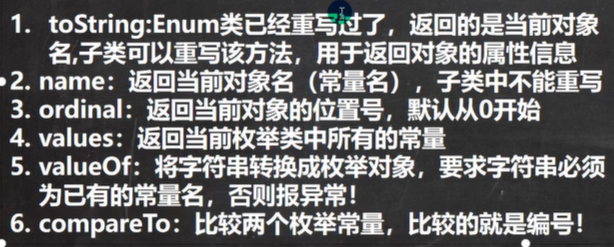

  ```java
  System.out.println(Season.SPRING);          SPRING
  System.out.println(Season.SPRING.name());   SPRING
  System.out.println(Season.SPRING.ordinal());0
  Season[] seasons = Season.values();			
  for(Season season : seasons) {
      System.out.println(season);				SPRING、SUMMER、AUTUMN、WINTER
  }
  Season season = Season.valueOf("SPRING");
  System.out.println(Season.SPRING.compareTo(Season.SUMMER));  -1（SPRING-SUMMER）
  ```

- 枚举可以使用switch语句，（）内写自己建立的枚举对象，case后面写enum中定义的枚举名


## 8.3、注解3

- @override
- @Deprecated：修饰某个类、成员变量、成员方法，表示已经过时，过时还是可以用的，只是不推荐
- @SuppressWarnings({"all","xxx","xxx"}}：表示抑制某种类型的warning，可以修饰类和方法，传入str数组

## 8.4、异常


# 8、设计模式

使用了大量的类变量和类方法。可以看成菜谱，一种体系化的代码结构和思考方式，免去自己思考的过程。

## 8.1、单例模式

在整个软件系统中，对某个类只能有一个实例化对象，且该类提供一个得到这个实例化对象的方法。分为饿汉式和懒汉式。适用于那种很消耗资源的类。

饿汉式：

- 构造器私有化，防止new
- 在类的内部创建该对象，静态（因为在getInstance这个静态方法中要使用）
- 向外提供一个公共的静态方法 getInstance

```java
class Dog {
    private String name;
    private static Dog dog = new Dog("111");

    private Dog(String name) {
        this.name = name;
    }
    public static Dog getInstance() {
        return dog;
    }
}
```

懒汉式：

- 跟饿汉式差不多，但是不会先new对象，而是只有在调用getInstance（）方法的时候才new对象
- 跟饿汉式相比，减少了资源浪费，只有需要的时候才创建，但是懒汉式是线程不安全的，饿汉式是线程安全的

```java
class Dog {
    private String name;
    private static Dog dog;

    private Dog(String name) {
        this.name = name;
    }
    public static Dog getInstance() {
        if (dog == null) {
            dog = new Dog("11");
        }
        return dog;
    }
}
```

## 8.2、模版模式

A和B都有这么一个需求：想计算一下各自job方法的运行时间，我们当然可以有普通的方法，但是也有更好的方法。这样，实例化A之后调用其calcluateTime()方法即可满足要求。

```java
abstract class Template{
    public abstract void job();
    
    public long calcluateTime() {
        long start = System.currentTimeMillis();
        job();
        long end = System.currentTimeMillis();
        return end - start;
    }
}
class A extends Template{
    @Override
    public void job() {
        ////
    }
}
class B extends Template{
    @Override
    public void job() {
        ////
    }
}
```


## 


1022 385-485 加油加油加油


# 8、递归（略）


# 2024我们又见面了

