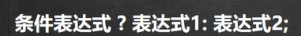

# 1、简介

## 1.1、历史

1995年，sun公司发布第一版Java 。

2009年，甲骨、文收购了sun公司。

2014年，发布了Java8，是长期支持版本。

2021年，发布了Java17，也是长期支持版本。

Java SE 标准版

Java EE 企业版

Java ME 小型版

## 1.2、Java特点

- 面向对象。
- 健壮。Java的强类型机制、异常处理、垃圾自动回收
- 跨平台性。.java（源文件）编译之后（使用”javac“命令）变为.class文件（字节码文件），这个.class文件可以在多个系统下运行（使用”java“命令）。
- 可解释性。Java是可解释性的，即编译之后的.class不可以直接被机器执行，需要解释器来执行；而c/c++是编译性语言，编译后的代码可以直接被机器执行。

下图是对特点34的解释：

 

JVM是包含在jdk里面的。

- JDK全称为Java开发工具包，JDK=JRE+java的开发工具（java javac等）
- JRE全称为Java运行时环境，JRE=JVM+核心类库

所以，对于程序员，要JDK；对于使用者，JRE就可以运行.class文件了！

## 1.3、个人相关

官网上下载jdk，可以看到里面有jre包


配置环境变量之后


## 1.4、一些注意事项

- 一个源文件最多只能有一个public类（可以没有），可以有多个其他类
- 如果源文件有public类，那么源文件名应该和这个public一致
- 对main方法的位置不做要求，可以在public类下，也可以不在，一个源文件可以有多个main方法


# 2、基础、变量、运算符

## 2.1、转义字符6

```java
System.out.println("你好\t啊");制表位
System.out.println("你好\n啊");换行
System.out.println("你好\\啊");输出\
System.out.println("你好\'啊");输出'
System.out.println("你好\"啊");输出"
System.out.println("你好\r啊");回车，在不同的平台上表现不一样，idea输出“啊”，控制台输出“啊好”
```

## 2.2、注释3

```java
// 单行注释

/* 多行注释

 */

下面是文档注释，@里面的内容叫文档标签（有规范，不是爱咋写咋写的），文档注释可以被jdk提供的javadoc解析为网页形式的说明文档，一般写在类和方法层面。
具体如何生成网页这里不介绍。
对于类和方法的注释最好使用文档注释。
/**
 * @author yzy
 * @version 1.0
 */
class Dog{
    
}
```

## 2.3、DOS命令（略）

控制台指令

## 2.4、数据类型8+3


整数类型详解：


```java
int a = 10;√  直接写一个数的话默认是int
int b = 10l;× 不像c++ 不会自动强制转换 需要手动
long c = 10;√ 自动类型转换
long d = 10l;√
```


浮点数类型详解：


- 浮点数=符号位+指数位+尾数位
- double的范围和精度都 > float
- int和float都是4B，但是范围却大了很多，所以float的精度不如int，本质上是一种取点近似
- 注意“浮点陷阱”，运算后的浮点数不要直接比较

```java
float a = 10.0f;√
float b = 10.0;× 不像c++ 不会自动强制转换 需要手动
double c = 10.0f;√ 自动类型转换
double d = 10.0;√ 直接写一个小数的话默认是double
```

 

字符类型详解：

```java
char a = 971;字符类型在底层存的是数字unicode，所以直接赋给char数字也是可以的，范围0-2^15-1
System.out.println(a);会自动把数字转为字符
    
char a = 'a' + 1;
System.out.println(a);字符本质是数字，所以可以进行加减，这里会输出字符b
```

- ascii
- unicode：字母汉字统一2B，包含世界上所有的符号，但是有点浪费，兼容ascii码
- UTF-8：变长存储，字母1B，汉字3B，是对unicode的改进，目前使用最多


布尔类型详解：

只有两种，true和false，与c不同，不可以使用0或者非0数字表示false或者true


## 2.5、数据类型的转换

**基本数据类型的自动类型转换**：jvm可以将范围小的类型自动转为范围大的类型（没错，float的范围远远大于8B的long）


细节：

- 多类型混合计算时，jvm自动将他们转为范围最大的那一个，然后才进行计算，但有例外

- char和（byte，short）之间不发生任何自动类型转换

- 你想把大范围类型转为小范围类型，一定报错，下面的例子除外

- ```java
  byte a = 10;虽然10是int，但是编译器会自动检查他有没有超过127，没有超过就可以
  
  int b = 10;
  byte c = b;这种就会报错，违背链
  ```

- char、byte、short之间可以运算，运算的时候会先转成int类型，看下面

- ```java
  byte a = 10;
  byte b = 10;
  short c = 10;
  short d = a + b;错误 已经转成int了
  int e = a + c;正确
  ```

- 注：double转int会擦去小数点


**基本数据类型的强制类型转换**：人工将范围大的类型转为范围小的类型

细节：

- 强转符号()只对最近的数有效，所以有的时候需要加括号改变优先级

- 对于char来说

- ```java
  int a = 100;
  char b = 100;虽然100是int，但是编译器会自动检查他有没有超限，没有超过就可以
  char c = a;错误 违背链
  char d = (char)a;正确
  ```


**8大基本数据类型转为String**

```java
int a = 10;
String s = a + "";加上""即可
```


**String转8大基本数据类型（8大基本数据类型 每个都有自己的包装类）**

```java
String s = "110";

byte n1 = Byte.parseByte(s);
short n2 = Short.parseShort(s);
int n3 = Integer.parseInt(s);
long n4 = Long.parseLong(s);

float n5 = Float.parseFloat(s);
double n6 = Double.parseDouble(s);

char ch1 = s.charAt(0);

boolean boo1 = Boolean.parseBoolean("true");
```

## 2.6、运算符4


几道例题：


```java
int a = 3/5;最后a=0 整数除法是整除
```


关系运算符的结果是true或者false

```
++a > 1先自增 再赋值比较
a++ > 1先比较 再自增
！！！这个和优先级不冲突
```

逻辑运算符如下：


&和&&的区别：&&更高效 ，用得多。  |和||也是同理。

赋值运算符的细节：

```java
byte a = 1;
a = a + 1;错误 int不能自动转byte
a += 1; 正确 +=操作会自动进行类型转换 因此 虽然二者等效 但是用下面的更好
```

**特别注意：赋值操作的返回值是赋值结束之后的值**

唯一三元运算符：




运算符的**大致优先级顺序**：括号 单目的加加减减 算术 移位 比较 逻辑 三元 赋值

## 2.7、命名规范

- 变量名可以使用26个字母的大小写，数字0-9，_和$
- 变量名数字不能打头
- 包名：全小写
- 类名和接口名：大驼峰
- 成员变量和成员方法：小驼峰
- 常量名：全大写，单词之间下划线  eg：TAX_RATE

## 2.8、输入

```java
import java.util.Scanner;

Scanner sc = new Scanner(System.in);
String s1 = sc.next();返回字符串 遇到空格或者换行停止
String s2 = sc.nextLine();如果需要输入有空格的字符串 用这个
int n1 = sc.nextInt();返回int类型的
double d1 = sc.nextDouble();
sc.close();关闭输入流
```


## 2.9、位运算


前四种运算的原则：

- 正数的原码=反码=补码
- 负数的反码=原码除了符号位外按位取反，负数的补码=负数的反码+1
- 前四个运算基于补码进行
- 但是最后结果呈现原码

eg1：


eg2：


eg3：


或者可以这么理解（对于整数）：>>相当于每次除2；<<相当于每次乘2


# 3、三大控制结构

## 3.1顺序

 略

## 3.2分支

```java
单
if(a > 1) {
    System.out.println();
}
双
if(a > 1) {
    
}else {
    
}
多
if(a > 1) {
    
} else if (a < 1) {
    
}else {
    
}
```

```java
int a = 1;
switch(a) {表达式，这里表达式的值应该和常量的类型一致或者能进行自动转换
    表达式的返回值只能是byte short int char String enum（浮点肯定不能拿来比较）
    
    case 1:这里应该是常量
        System.out.println(1);
        break;一般要有 没有会穿透
    case 2:
        System.out.println(2);
        break;
    case 3:
        System.out.println(3);
        break;
    default:
        System.out.println(4);
        break;
}
```

## 3.3循环

```java
for (int i = 0; i < 10; i++) {
    System.out.println(i);
}初始化之后也是先判断 true才执行

int i = 0;
while (i < 10) {
    System.out.println(i);
    i++;
}


do {
    System.out.println(i);    
}while (i < 10);最少都会执行一次
```

- break：跳出循环。可以使用标签指定跳出的循环，不指定则跳出最近的循环，一般不指定。
- continue：跳出本次循环（即到达}处），进入下一次循环。可以使用标签指定跳出的循环，不指定则跳出最近的循环，一般不指定。
- return：跳出方法。

# 4、引用数据类型——数组

## 4.1、初始化3

```java
动态1：
int[] arr1 = new int[5];
动态2：
int[] arr2;
arr2 = new int[5];new的时候才分配空间
静态1：
int[] arr3 = {1,2,3,4,5};
```

- 数组分配空间后，如果没赋值，jvm会默认赋值，整数0，浮点0.0，char0，boolean为false，String为null
- 数组可以存放基本数据类型或者引用数据类型class等，但是不可以混用

## 4.2、值copy和址copy


- 值copy：**基本数据类型**为值传递
- 址copy：**引用类型**为址传递，其实本质上还是值传递，只不过这个值是地址罢了


# 2024我们又见面了